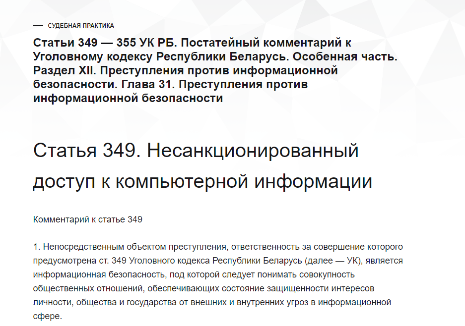

# Расширение и набор скриптов для удаления активности в инстаграмме

Работает в браузере.  

Есть 2 варианта использования:
- Ручной запуск скриптов в консоли
- Установка расширения

## Использование вручную

- Откройте файл [Удаление комментов](https://raw.githubusercontent.com/isadora-6th/instagram-activity-remover/refs/heads/main/scripts/rm_comments.js), скопируйте его содержимое в буфер обмена (CTRL + A / CTRL + C)
- Откройте [страницу комментариев](https://www.instagram.com/your_activity/interactions/comments) в инстаграмме
- F12
- Вставьте содержимое в терминал
- Enter
- Успех

Раз в иногда, инстаграмм выдает ошибку, что не все комментарии удалось удалить.
Это нормально и для решения этой проблемы в скрипт уже включен детектор отсутствия прогресса. Страница перезагрузится самостоятельно и пользователю заново придется ввести скрипт в консоль.

Идентичный подход для удаления лайков
- Откройте файл [Удаление лайков](https://raw.githubusercontent.com/isadora-6th/instagram-activity-remover/refs/heads/main/scripts/rm_likes.js), скопируйте его содержимое в буфер обмена (CTRL + A / CTRL + C)
- Откройте [страницу лайков](https://www.instagram.com/your_activity/interactions/likes) в инстаграмме
- F12
- Вставьте содержимое в терминал
- Enter
- Успех

Пример применения вручную:

## Установка расширения

Нужна для решения проблемы ручной вставки скрипта при перезагрузке страницы
Инстаграмм достаточно часто выдает ошибку удаления и для полной автоматизации процесса лучше установить расширение.

- Скачать архив репозитория  

- Распаковать архив
- Перейти в [расширения](chrome://extensions/)
- Включить режим разработчика  

- Выбрать папку распакованного архива с расширением

- Откройте pop-up расширения и проставьте галки на нужном функционале

- Откройте [страницу комментариев](https://www.instagram.com/your_activity/interactions/comments) в инстаграмме
- Откройте [страницу лайков](https://www.instagram.com/your_activity/interactions/likes) в инстаграмме

После загрузки скрипт автоматически запустит процесс удаления (включаемо и выключаемо в pop-up расширения)

# Но... Зачем?

За 10 лет эксплуатации инстаграмма я стал совсем другим человеком и даже в теории не могу представить что я мог написать за все эти годы и что лайкнуть. В связи с растущим числом случаев привлечения всех подряд законными и незаконными (кэнцэл калча) способами к ответственности за оставленные в интернете буквы - нецелесообразно оставлять их там.

Они не содержат художественной значимости, не очень релевантны к моему текущему мировоззрению и в целом, а зачем.

А также академический интерес, обладание чрезмерно обширными знаниями по написанию скриптиков для сайтов и обладанием очень удобным темплейтом расширения созданного немного для других задач, но крайне удобно подошедший к текущему положению дел.

4 fun кароч. Чтобы повыпендриваться что так могу

# Безопасность

Инстаграм в своем волшебном окошке (F12) абсолютно справедливо отмечает, что запускать там скрипты предоставленные 3ими лицами это ничегосебе дыра и вообще путь к тому что-бы потерять аккаунт.  
Это правда так. Каких-то осмысленных доказательств что я вас НЕ собираюсь взламывать я не могу. Можете почитать код скриптов или расширения. В целом я сделал это для себя и потенциально 1-2 друзей кто знает меня лично. Ваше личное дело, доверять мне или нет. Но от чтения всякого интересного (местных скриптов) в интернете плохо явно не станет.

Припрет - найдут

https://bypravo.ru/postatejnyj-kommentarij-k-ugolovnomu-kodeksu-respubliki-belarus-osobennaya-chast-razdel-xii-prestupleniya-protiv-informatsionnoj-bezopasnosti-glava-31-prestupleniya-protiv-informatsionnoj-bezopas/

Да и зачем?)

# Issues

Скрипт работает на базе русской локали в самом инстаграмме.
Самый простой и безболезненный путь - временно поставить RU локаль.

Если все же не хочется, в файлах 
- scripts/rm_likes.js
- scripts/rm_comments.js

Нужно заменить слова 'Сортировка и фильтр' 'От старых к новым' и прочие на строки соответствующие подписям на вашем языке
Дальше соответственно перезагрузить расширение или применять улучшенный файл вручную

